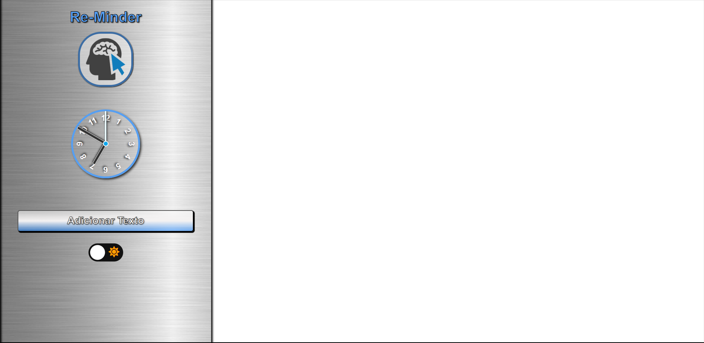
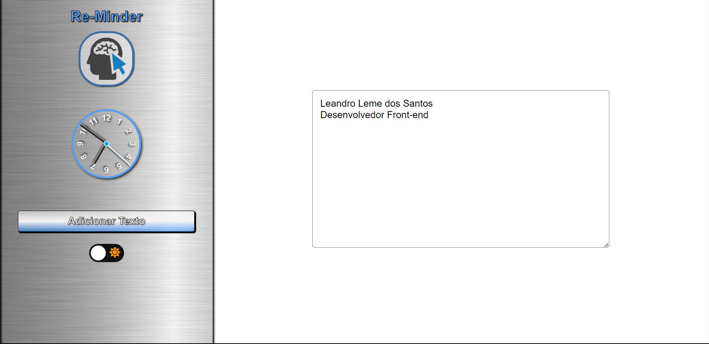
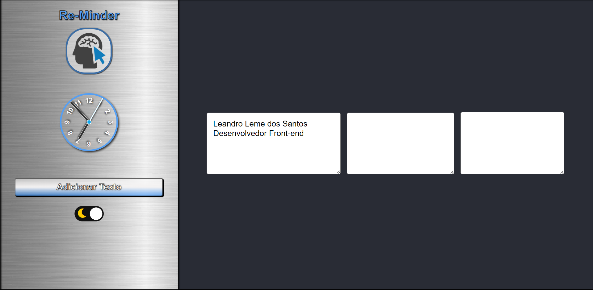
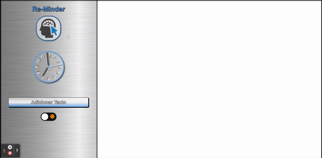

# Re-Minder

Deploy: https://re-minder.vercel.app/

## Sobre

Se trata de uma ferramenta para criar caixas de texto, tipo "post-it" para anotações temporárias em geral.

### Objetivos

Praticar minhas habilidades atuais e ver quantas implementações de outros projetos consigo adaptar e que fique funcional.

### Desafio

Conseguir adaptar com sucesso implementações de projetos passados incluindo o Mobile First.

### Conclusão

Consegui concluir mais esta aplicação para web e mobile aplicando a práticas de projetos passados. Fiquei muito contente com o resultado.

### Ferramentas Utilizadas

- HTML
- CSS
- Javascript
